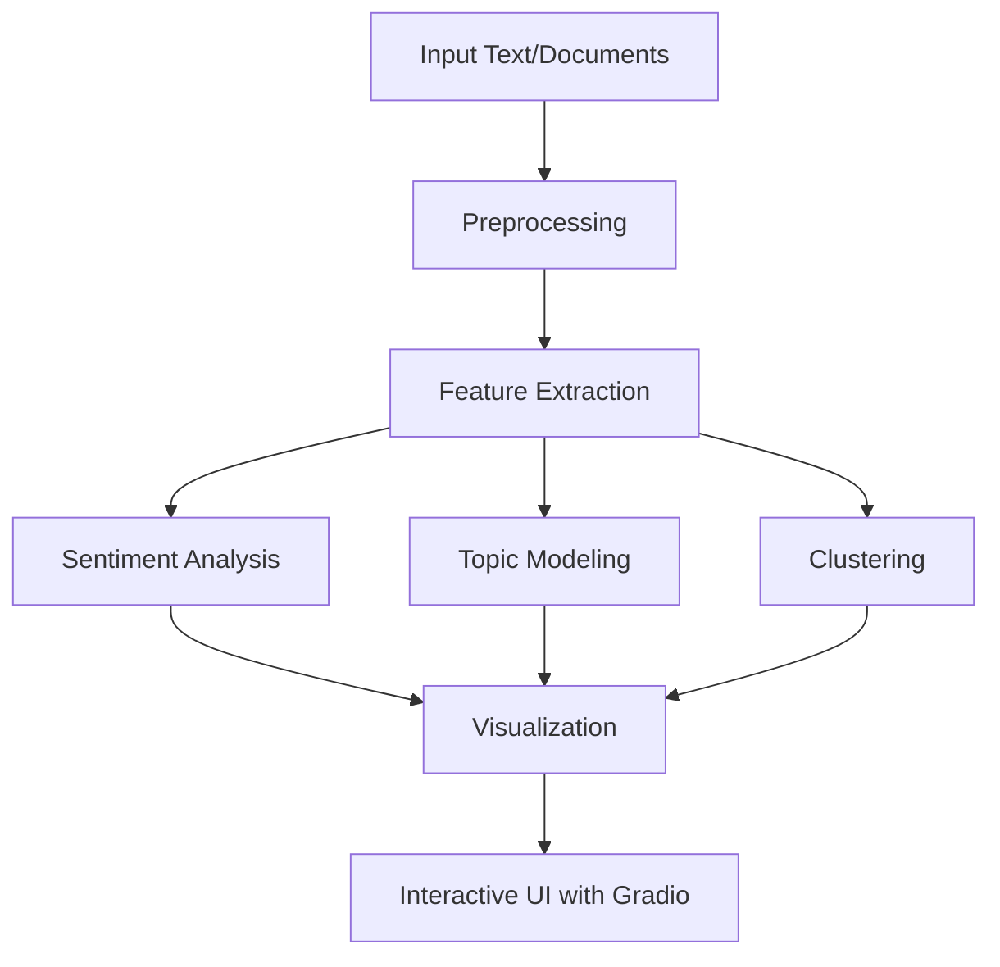

# NLP Pipeline with Graceful Clustering

This repository provides a comprehensive **Natural Language Processing (NLP) Pipeline** for text analysis, visualization, and clustering. Built with Python, the pipeline includes advanced NLP techniques integrated into an **interactive Gradio interface**, allowing users to explore results in a user-friendly web application.

---

## Features

- **Preprocessing**: Tokenization, stopword removal, POS tagging, and named entity recognition.
- **Sentiment Analysis**: Extract polarity, subjectivity, and emotional classification.
- **Topic Modeling**: Identify dominant themes in documents using LDA.
- **Keyword Extraction**: Utilize TF-IDF and RAKE for extracting significant terms.
- **Clustering**: Group documents using KMeans for similarity-based segmentation.
- **Visualization**:
  - Word clouds.
  - TF-IDF bar charts.
  - Co-occurrence networks.
  - Sentence polarity heatmaps.
- **Readability Analysis**: Assess complexity using metrics like Flesch Reading Ease.
- **Interactive Interface**: Explore results via a Gradio-powered web UI.

---

## Workflow

### Step-by-Step Process

1. **Input**: Provide a text and optional documents for comparison.
2. **Preprocessing**: Tokenize, remove stopwords, and tag parts of speech.
3. **Feature Extraction**: Compute TF-IDF scores and extract keywords with RAKE.
4. **Analysis**:
   - Sentiment analysis.
   - Semantic similarity computation.
   - Readability scoring.
5. **Modeling**:
   - Topic modeling with LDA.
   - Clustering documents using KMeans.
6. **Visualization**:
   - Generate word clouds, TF-IDF bar charts, co-occurrence networks, and sentiment heatmaps.
7. **Interactive Results**: View and explore outputs through the Gradio web interface.

---

## Key Libraries and Their Roles

| **Library**       | **Purpose**                                                                 |
|--------------------|-----------------------------------------------------------------------------|
| **spacy**         | Tokenization, dependency parsing, named entity recognition (NER).           |
| **nltk**          | Tokenization, stopword removal, and POS tagging.                            |
| **textblob**      | Sentiment analysis (polarity and subjectivity).                             |
| **scikit-learn**  | TF-IDF computation, topic modeling (LDA), and clustering (KMeans).          |
| **rake-nltk**     | Extract keywords using RAKE.                                                |
| **textstat**      | Compute text readability metrics.                                           |
| **matplotlib**    | Create visualizations like bar charts and heatmaps.                         |
| **seaborn**       | Enhance visualizations, especially for sentiment heatmaps.                  |
| **networkx**      | Build co-occurrence networks for word relationships.                        |
| **wordcloud**     | Generate word clouds to visualize frequent terms.                           |
| **gradio**        | Build an interactive web interface for result exploration.                  |

---

## Workflow Diagram



---

## Installation

### Prerequisites

- Python 3.8 or higher.

### Steps

1. Clone the repository:
   ```bash
   git clone https://github.com/your-username/nlp-pipeline.git
   cd nlp-pipeline
   ```

2. Install dependencies:
   ```bash
   pip install -r requirements.txt
   ```

3. Download required NLTK and SpaCy resources:
   ```python
   python -c "import nltk; nltk.download('punkt'); nltk.download('stopwords')"
   python -m spacy download en_core_web_sm
   ```

---

## Usage

1. **Run the Application**:
   ```bash
   python main.py
   ```
   This starts the Gradio web server.

2. **Access the Interface**:
   Open the link displayed in the terminal (e.g., `http://127.0.0.1:7860`).

3. **Provide Input**:
   - Text: The primary text for analysis.
   - Documents: Optional additional documents for clustering and comparison.

4. **Explore Results**:
   - Named entities, keywords, and sentiment analysis.
   - Visualizations like word clouds, TF-IDF bar charts, and heatmaps.

---

## Example Input and Outputs

### Input
- **Text**: `"Artificial intelligence revolutionizes modern industries."`
- **Documents**:
  ```
  AI is transforming healthcare.
  Machine learning enhances decision-making.
  Robotics drives automation.
  ```

### Output
#### JSON Results
```json
{
  "entities": [["Artificial intelligence", "NOUN"]],
  "sentiment": {
    "polarity": 0.8,
    "subjectivity": 0.6,
    "classification": "Positive"
  },
  "topics": {
    "Topic 1": ["ai", "decision", "healthcare"]
  },
  "readability_scores": {
    "flesch_reading_ease": 74.5,
    "gunning_fog_index": 8.3
  }
}
```

#### Visual Outputs
- **Word Cloud**: Displays frequent terms like "AI" and "intelligence."
- **TF-IDF Chart**: Highlights the most relevant keywords.
- **Polarity Heatmap**: Shows sentiment variations across sentences.

---

## Troubleshooting

| **Issue**            | **Solution**                                                                 |
|-----------------------|-----------------------------------------------------------------------------|
| Missing NLTK data     | Run `nltk.download("punkt"); nltk.download("stopwords")`.                  |
| Backend errors        | Uncomment `matplotlib.use('Agg')` in `main.py`.                            |
| SpaCy model issues    | Run `python -m spacy download en_core_web_sm`.                             |

---

## Screenshots

### Gradio Interface


### Visualizations


---

## Customization

- **Number of Topics**: Modify in `topic_modeling()`:
  ```python
  topic_modeling(documents, n_topics=4)
  ```

- **Number of Clusters**: Adjust in `cluster_documents()`:
  ```python
  cluster_documents(documents, n_clusters=5)
  ```

---

## Contribution

We welcome contributions! Feel free to fork the repository, submit pull requests, or raise issues for bugs or feature requests.

---

## License

This project is licensed under the MIT License. See the `LICENSE` file for details.

---

## References

- [SpaCy Documentation](https://spacy.io/)
- [NLTK Documentation](https://www.nltk.org/)
- [Gradio Documentation](https://gradio.app/)
- [TextBlob Documentation](https://textblob.readthedocs.io/)

Happy analyzing! 🚀
