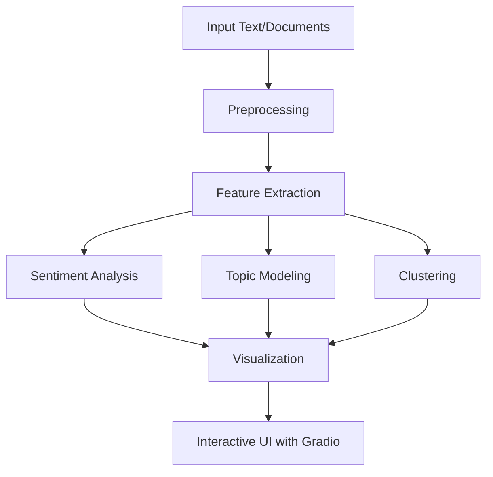

# NLP Pipeline with Graceful Clustering

This **Natural Language Processing (NLP) Pipeline** provides a comprehensive solution for analyzing, clustering, and visualizing text data. It integrates advanced machine learning techniques with a user-friendly **Gradio interface**, enabling users to interactively explore results with structured outputs and dynamic visualizations.

---

## Key Features

1. **Text Preprocessing**:
   - Tokenization, stopword removal, and POS tagging.
   - Named Entity Recognition (NER) for identifying entities.
2. **Feature Extraction**:
   - **TF-IDF Analysis**: Highlights significant terms.
   - **Keyword Extraction**: Uses RAKE for extracting relevant phrases.
3. **Analysis**:
   - **Sentiment Analysis**: Evaluates text polarity and subjectivity.
   - **Readability Metrics**: Calculates text complexity using multiple readability indices.
   - **Dependency Parsing**: Identifies linguistic dependencies.
4. **Clustering**:
   - Groups documents based on similarity using KMeans clustering.
5. **Topic Modeling**:
   - Identifies dominant themes in documents using Latent Dirichlet Allocation (LDA).
6. **Visualization**:
   - **Word Cloud**: Displays frequent terms.
   - **TF-IDF Bar Chart**: Highlights keyword scores.
   - **Co-occurrence Network**: Visualizes relationships between terms.
   - **Polarity Heatmap**: Displays sentence-level sentiment variations.
7. **Interactive Interface**:
   - Powered by **Gradio**, offering an easy-to-use web-based interface for exploring results.

---

## Requirements

### Dependencies
The required Python packages are listed in `requirements.txt`:
```plaintext
spacy
wordcloud
networkx
nltk
textblob
scikit-learn
seaborn
matplotlib
rake-nltk
textstat
gradio
openai
```

### Installation
1. Clone the repository:
   ```bash
   git clone https://github.com/your-repo/nlp-pipeline.git
   cd nlp-pipeline
   ```

2. Install the dependencies:
   ```bash
   pip install -r requirements.txt
   ```

3. Download required NLTK and SpaCy resources:
   ```bash
   python -c "import nltk; nltk.download('punkt'); nltk.download('stopwords')"
   python -m spacy download en_core_web_sm
   ```

---

## Workflow

### Workflow Overview

1. **Input Text and Documents**:
   - Users provide a text string for analysis and optional documents for comparison.
   
2. **Preprocessing**:
   - Tokenize text, remove stopwords, and tag parts of speech.
   - Extract named entities and clean tokens for further analysis.
   
3. **Feature Extraction**:
   - Compute **TF-IDF** scores for identifying important terms.
   - Extract keywords using **RAKE**.

4. **Analysis**:
   - Perform **sentiment analysis** to evaluate polarity and subjectivity.
   - Assess **readability metrics** using indices like Flesch Reading Ease.
   - Parse linguistic dependencies to understand relationships in text.

5. **Clustering and Topic Modeling**:
   - Group similar documents using **KMeans clustering**.
   - Identify key topics with **LDA (Latent Dirichlet Allocation)**.

6. **Visualization**:
   - Generate visual outputs like:
     - **Word Cloud**
     - **TF-IDF Chart**
     - **Co-occurrence Network**
     - **Polarity Heatmap**

7. **Interactive Results**:
   - Use **Gradio** for an intuitive, web-based exploration of results.

---

## Workflow Diagram



---

## Code Structure

### Key Functions

#### Text Preprocessing
```python
def dependency_parsing(text):
    doc = nlp(text)
    for token in doc:
        print(f"{token.text} -> {token.dep_} -> {token.head.text}")
```

#### Feature Extraction
```python
def compute_tfidf(documents, top_n=5):
    vectorizer = TfidfVectorizer(stop_words="english")
    tfidf_matrix = vectorizer.fit_transform(documents)
    feature_names = vectorizer.get_feature_names_out()
    dense = tfidf_matrix.todense()
    scores = dense[0].tolist()[0]
    tfidf_scores = [(feature_names[i], scores[i]) for i in range(len(scores))]
    sorted_scores = sorted(tfidf_scores, key=lambda x: x[1], reverse=True)
    return sorted_scores[:top_n]
```

#### Clustering
```python
def cluster_documents(documents, n_clusters=3):
    vectorizer = TfidfVectorizer(stop_words="english")
    tfidf_matrix = vectorizer.fit_transform(documents)
    km = KMeans(n_clusters=n_clusters, random_state=42)
    km.fit(tfidf_matrix)
    return km.labels_
```

#### Visualization
- **TF-IDF Chart**:
  ```python
  def visualize_tfidf_figure(tfidf_scores):
      fig, ax = plt.subplots()
      words, scores = zip(*tfidf_scores) if tfidf_scores else ([], [])
      ax.barh(words, scores)
      ax.set_xlabel("TF-IDF Score")
      ax.set_title("Top TF-IDF Keywords")
      plt.tight_layout()
      return fig
  ```
- **Word Cloud**:
  ```python
  def generate_wordcloud_figure(text):
      wordcloud = WordCloud(width=800, height=400, background_color="white").generate(text)
      fig, ax = plt.subplots(figsize=(10, 5))
      ax.imshow(wordcloud, interpolation="bilinear")
      ax.axis("off")
      ax.set_title("Word Cloud")
      plt.tight_layout()
      return fig
  ```

---

## Usage

### Running the Application
1. Start the application:
   ```bash
   python app.py
   ```
2. Open the Gradio interface at `http://127.0.0.1:7861`.

### Example Input
- **Text**: `"Artificial intelligence revolutionizes industries."`
- **Documents**:
  ```
  AI is transforming healthcare.
  Robotics drives automation.
  Machine learning enables new opportunities.
  ```

### Example Output
- **Named Entities**: `["Artificial intelligence", "industries"]`
- **Sentiment Analysis**: `Positive (Polarity: 0.85)`
- **Clusters**: `[0, 1, 2]`
- **TF-IDF Keywords**: `["artificial", "intelligence", "revolutionizes"]`
- **Readability Scores**:
  ```json
  {
      "flesch_reading_ease": 70.2,
      "gunning_fog_index": 8.3,
      "smog_index": 7.2
  }
  ```

---

## Gradio Panels

### Inputs
- **Text**: Multiline input for primary text analysis.
- **Documents**: Optional multiline input for document clustering and comparison.

### Outputs
- **JSON Results**: 
  - Named entities, clean tokens, word frequencies, sentiment analysis, etc.
- **Visualization Panels**:
  - Word Cloud, Polarity Heatmap, Co-occurrence Network, and TF-IDF Chart.

---

## Customization

- **Adjust Number of Topics**:
  ```python
  topic_modeling(documents, n_topics=5)
  ```
- **Modify Clusters**:
  ```python
  cluster_documents(documents, n_clusters=4)
  ```

---

## Troubleshooting

| **Issue**                 | **Solution**                                                      |
|----------------------------|------------------------------------------------------------------|
| Missing NLTK Data          | Run `nltk.download('punkt')` and `nltk.download('stopwords')`.  |
| SpaCy Model Missing        | Run `python -m spacy download en_core_web_sm`.                  |
| Backend Errors             | Uncomment `matplotlib.use('Agg')` for compatibility.           |

---

## Contribution

We welcome contributions! Fork the repository, make changes, and submit pull requests to enhance features or fix bugs.

---

## License

This project is licensed under the MIT License. See the `LICENSE` file for details.

---

## Screenshots

### Gradio Interface


### Visualizations
- **Word Cloud**:
  

- **Polarity Heatmap**:
  

- **TF-IDF Keywords**:


- **Co-occurence Network**:


## References
- [SpaCy Documentation](https://spacy.io/)
- [NLTK Documentation](https://www.nltk.org/)
- [TextBlob Documentation](https://textblob.readthedocs.io/)
- [Gradio Documentation](https://gradio.app/)

Happy Analyzing! 🚀
